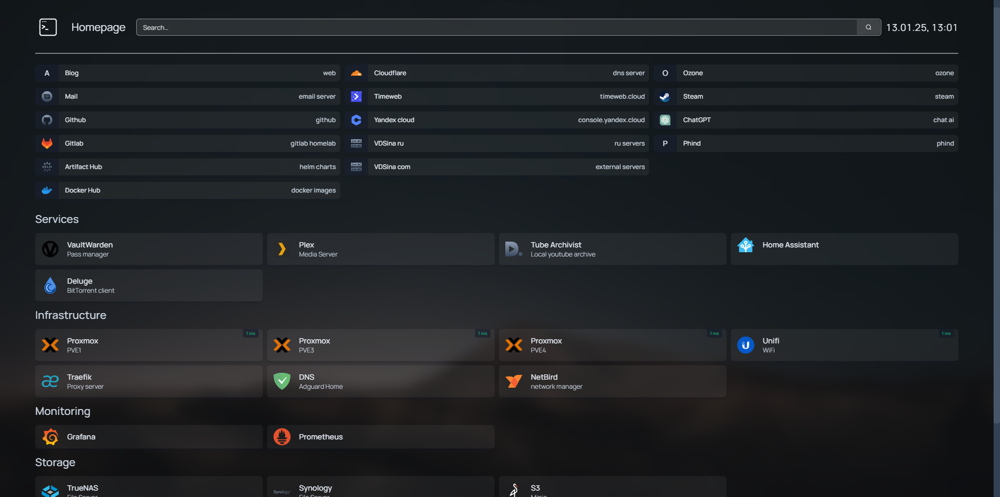

# Homelab homepage


My homepage config example

Project: [gethomepage/homepage](https://github.com/gethomepage/homepage)




deploy doker compose

**Search:** yandex


example url from env
```yaml
href: {{HOMEPAGE_VAR_YOUR_URL}}
```

## Icons

Docs: https://gethomepage.dev/configs/services/#icons

Default svg  https://github.com/homarr-labs/dashboard-icons/tree/main/svg
```yaml
- Plex:
    icon: plex.svg
```


Dimple icon
https://simpleicons.org/?q=github
```yaml
- Github:
    - icon: si-github
```


---

- TODO - check build and deploy static files